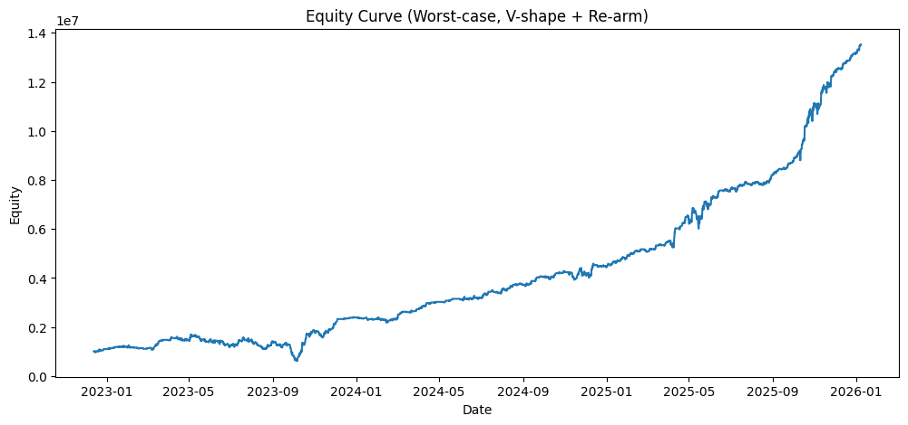

# grid-mean-reversion-risk-engine

A grid-based mean reversion backtesting engine designed with a **risk-first approach**,
focusing on weighted average exposure, worst-case drawdown, and noise-resistant execution logic.

This project is intentionally built around **risk realism**, not headline returns.

---

## Overview

This repository contains a research-oriented backtesting engine for
grid and mean reversion strategies, with particular emphasis on
**portfolio-level risk behaviour**.

Rather than optimising for entry signals or profitability alone,
the engine focuses on how **unrealised exposure and drawdown evolve**
when positions are accumulated over time.

---

## Sample Backtest Output

Worst-case equity curve (intrabar unrealised-aware, V-shape re-arm logic):

---

### Backtest Summary (Illustrative)

- Instrument: XAUUSD
- Timeframe: H4
- Test window: ~2 years
- Strategy: Grid-based mean reversion with V-shape re-arm
- Total trades: ~770
- Max drawdown (worst-case, intrabar): ~64%
- Drawdown methodology: Unrealised exposure vs weighted average price (WAP)

> Results are illustrative and intended to highlight **risk and exposure dynamics**,  
> not to demonstrate return optimisation.

---

## Core Ideas

- **V-shape mean reversion logic**  
  Price compression followed by a one-grid reversal confirmation.

- **Depth-driven position sizing**  
  Position size scales with market pressure, measured as distance from a reference anchor.

- **Position aggregation via weighted average price (WAP)**  
  All open positions are aggregated into a single effective exposure.

- **Worst intrabar drawdown measurement**  
  Unrealised exposure is marked using intrabar lows (worst-case), not closing prices.

- **Re-arm execution logic**  
  Prevents noise-driven overtrading at the same grid level while allowing repeated entries
  when genuine new price compression occurs.

---

## Risk Philosophy

Most grid backtests underestimate risk by ignoring unrealised exposure
and evaluating drawdown only on closed trades or bar closes.

This engine explicitly treats **open positions as real risk**.

Drawdown is measured at the **portfolio level**, using:
- Weighted average entry price (WAP)
- Total open position size
- Worst intrabar price movement within each bar

This approach provides a more conservative and realistic view of drawdown,
particularly for grid and mean reversion strategies where exposure can
accumulate before mean reversion occurs.

---

## Why This Matters

In grid and mean reversion systems, risk often materialises
*before* trades are closed.

By explicitly accounting for unrealised exposure and worst-case intrabar
movements, this engine highlights how drawdowns can develop even when
a strategy appears stable or profitable on a close-to-close basis.

The goal of this project is not to present an optimal strategy,
but to demonstrate how **risk-aware system design** changes the way
performance should be evaluated.

---

## Backtest Characteristics

- Instrument: XAUUSD
- Timeframe: H4
- Strategy type: Grid-based mean reversion
- Entry logic: V-shape reversal
- Exit logic: Fixed grid take-profit

Key characteristics:
- Multiple open positions allowed
- No assumption of immediate mean reversion
- Unrealised losses fully reflected in drawdown calculations

---

## Sample Backtest Result (Illustrative)

The following results are provided for **illustrative and diagnostic purposes only**.
They are intended to highlight **risk behaviour and exposure dynamics**, not to
demonstrate optimal performance.

**Backtest context**
- Instrument: XAUUSD  
- Timeframe: H4  
- Test length: ~2 years  
- Strategy: Grid-based mean reversion with V-shape confirmation  

**Key observations**
- Prolonged price compression led to a gradual increase in open exposure before any
  mean reversion occurred.
- Maximum drawdown was driven primarily by **unrealised losses**, not realised trades.
- Worst-case drawdown materialised **before** price reverted back to the grid mean.
- Portfolio-level drawdown significantly exceeded close-to-close equity drawdown,
  highlighting the risk of ignoring intrabar extremes in grid strategies.

These observations reinforce the importance of evaluating grid systems using
**weighted average exposure and worst-case intrabar pricing**, rather than relying
solely on realised PnL or bar-close equity curves.

---

## Outputs

The engine produces:
- Detailed trade logs (entry, exit, size, depth)
- Equity curves based on worst-case unrealised exposure
- Portfolio metrics such as open lots and weighted average price

Outputs are exported in Excel format for auditability and further analysis.

---

## Disclaimer

This project is for research and educational purposes only.  
It is **not intended for live trading, execution, or investment advice**.
